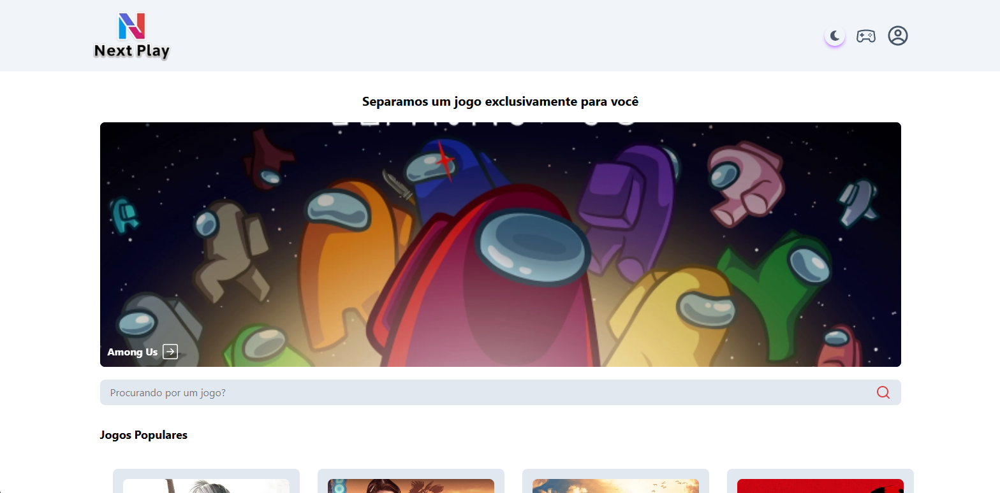
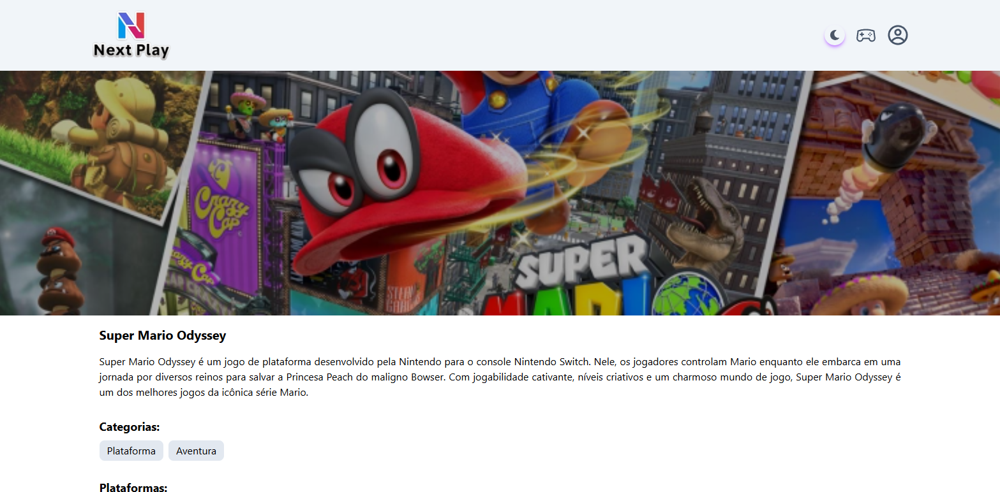
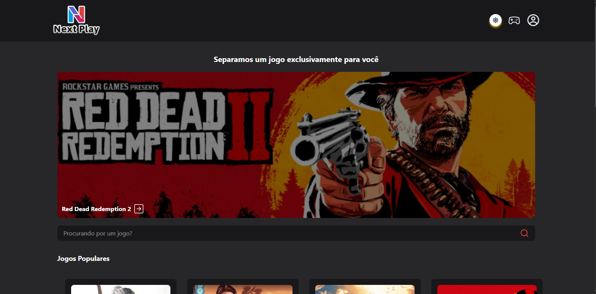

# Next Play 🎮

Uma versão aprimorada do projeto Daly Games do curso Fullstack Pro do Sujeito Programador. Next Play é um catálogo de jogos moderno e interativo com modo claro/escuro, desenvolvido com Next.js e TypeScript.


## ✨ Funcionalidades

- Catálogo de Jogos: Navegue por uma coleção de jogos
- Páginas de Detalhes: Visualize informações detalhadas de cada jogo
- Modo Claro/Escuro: Alternância entre temas claro e escuro
- Design Responsivo: Interface adaptada para todos os dispositivos
- Tipagem Estrita: Desenvolvido com TypeScript para maior confiabilidade

## 🛠️ Tecnologias Utilizadas

- Next.js 15: Framework React com App Router e Server Components
- TypeScript: Superset JavaScript com tipagem estática
- Tailwind CSS: Framework CSS utilitário para estilização

## 🚀 Como Executar o Projeto

1. Clone o repositório:
   ```bash
   git clone https://github.com/christopher-salomao/next-play.git
   ```
2. Instale as dependências:
   ```bash
   npm install
   # ou
   yarn install
   ```
3. Excute o projeto em desenvolvimento:
   ```bash
   npm run dev
   # ou
   yarn dev
   ```
4. Abra http://localhost:3000 no seu navegador.

## 📦 Scripts Disponíveis

- **npm run dev** - Inicia o servidor de desenvolvimento
- **npm run build** - Constrói a aplicação para produção
- **npm run start** - Inicia o servidor de produção

## 🎨 Personalização

Este projeto utiliza Tailwind CSS para estilização, permitindo fácil customização:

- Modifique as cores e tema no arquivo aap/globals.css
- As variáveis de tema claro/escuro estão definidas em app/globals.css
- Consulte a documentação do Tailwind CSS para referência

## 📱 Responsividade

A aplicação é totalmente responsiva e adaptada para:

- Dispositivos móveis (smartphones)
- Tablets
- Desktops

## 🔧 Principais Melhorias em Relação ao Original

Sistema de Tema Claro/Escuro: Implementação completa de alternância entre temas

- Rebranding: Novo nome (Next Play) e identidade visual
- Refinamento de Design: Melhorias na interface e experiência do usuário
- TypeScript: Adição de tipagem estática para maior confiabilidade

## 🤝 Contribuição

Contribuições são bem-vindas! Sinta-se à vontade para:

- Reportar problemas
- Sugerir novas funcionalidades
- Enviar pull requests

## 📷 Preview







## 📄 Licença

Este projeto foi desenvolvido para fins educativos e não possui fins comerciais.
